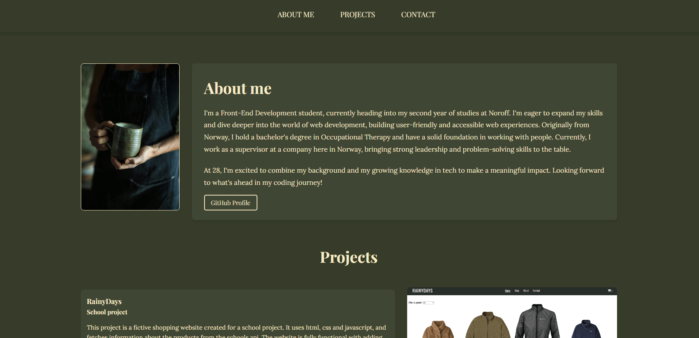

# My Portfolio

This is the start of my portfolio  

## Description

Currently working on this portfolio. As of now it is live and submitted for a school project, but I will be working on this continuesly throughout my coding journey.

I want my portfolio to:

- Showcase projects I am proud of
- Be a way to find information about me and how to reach me
- Be a place for me to experiment with and work on my coding skills

## Built With

- HTML
- CSS

## Getting Started

The website is hosted live on Github Pages [here](https://maribsorensen.github.io/Portfolio/).

## Contact

[My LinkedIn page](https://no.linkedin.com/in/mari-berg-s%C3%B8rensen-b63425156)
