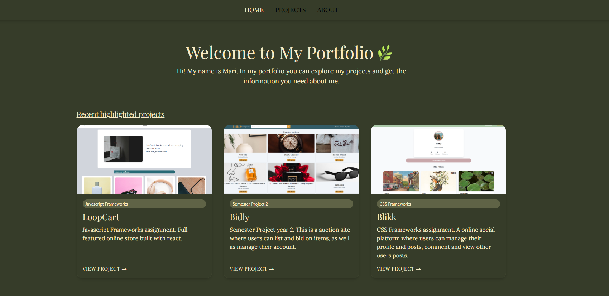

# 💫 Mari Berg Sørensen — Portfolio



A modern developer portfolio built with **React**, **Vite**, and **Tailwind CSS**.  
Showcasing my front-end development skills, selected projects, and ways to get in touch.

---

## Tech Stack

- **React** — Front-end framework
- **Tailwind CSS** — Utility-first styling
- **Vite** — Fast build tooling
- **React Router** — Navigation and routing
- **Custom Hooks** — For page metadata and dynamic UI logic

## Features

- **Dynamic page metadata** using a custom `usePageMeta` hook
- **Responsive design** optimized for all screen sizes
- **Project showcase section** with live demos and GitHub links
- **Contact links** (LinkedIn, GitHub) in the footer
- **Lightweight and fast** — built with performance in mind

## Setup & Installation

**Steps:**

1. Clone the repository:

```bash
git clone https://github.com/Maribsorensen/Portfolio.git
```

2. Install dependencies

```bash
npm install
```

3. Start the development server

```bash
npm run dev
```

## Live Demo
